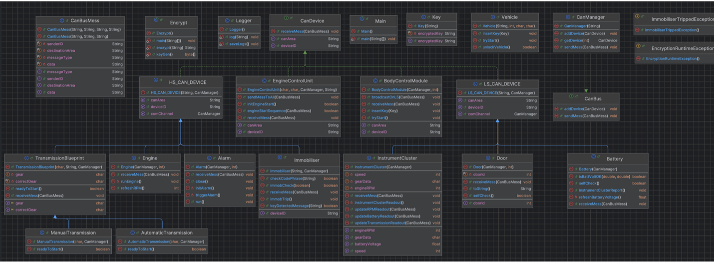

# Indításgátló modell - fejlesztői dokumentáció
###### Készitette Fabriczius Dávid Ferenc

Ez a program egy indításgátlót modellez. A modellezés tartalmaz kulcs egyeztetést, riasztót, illetve a különféle autóalkatrészek állapotát is ellenőrzi mielőtt az indítást engedné. 

### 1. Klónozd a repót
```bash
git clone https://github.com/realdaveeeed/Immobiliser_Model_in_Java.git
cd Immobiliser_Model_in_Java
```
### 2. Futtatás
1. Nyisd meg az IntelliJ IDEA-t.
2. Válaszd a **File → Open** menüpontot.
3. Tallózd be a projekt gyökerét, majd kattints **Open**.
4. A bal oldali projektstruktúrában kattints jobb gombbal a `src` mappára.
5. Válaszd a **Mark Directory as → Sources Root** lehetőséget.
6. Kattints jobb gombbal a com mappában lévő `Main.java` fájlra (ami tartalmazza a `main` metódust).
7. `Run Main.main()`

## 1. Rendszerarchitektúra
A különböző alkatrészek kommunikációjáért a CAN bus (kommunkációs sín) felel.

3 különböző sín található meg a modellben.
Első a magas sebességű sín (high-speed / HS_CAN) amely a magas prioritást élvező alkatrészek kommunikációjáért felel. 
Ilyen például a motor, az indításgátló, a sziréna, a váltó. 

Második az alacsony sebességű sín (low-speed / LS_CAN), itt kommunikálnak az olyan alkatrészek, mint a műszerfal és ajtók. 

A harmadik egy összefogó sín (JUNCTION), amely a két sín közötti kommunikációért felel. Ilyen például, amikor a Body Control Module elküldi azt az indításgátlónak, hogy új kulcsot érzékel és hitelesítse a kulcs kódját, vagy amikor a motor küld fordulatszám információt a műszerfalnak.

### Kommunikációs sín parancsai, jelentései és a program osztálydiagramja
| Parancs | Jelentés |
|---------|----------|
|KEY_DETECTED (0001)|Motorindítási folyamat kezdeményezése, tartalmazza a titkosított kulcsot.|
|KEY_OK (0002)|A kulcs ellenőrzése sikeres volt|
|KEY_FAILED (0003)|Kódegyezési hiba történt, az indítás nem lehetséges.|
|INIT_START (0000)|A motorindítási folyamat elindítása.|
|SELF_CHECK (0004)|Önteszt kérés az összes regisztrált eszköz felé (meghívja az IMMOB_CHECK-et is).|
|SEFL_CHECK_FAILED(0005)|Az önteszt eredménye hibás volt. Ilyenkor elküldi az IMMOB_TRIP üzenetet.|
|IMMOB_TRIP (1000)|Az immobiliser letiltását okozza, az indítás nem lehetséges.|
|IMMOB_CHECK (1001)|Az immobiliser állapotának ellenőrzése.|
|IMMOB_OK (1002)|Az indítás engedélyezett|
|INSTR_CLSTR_REFRESH(2000)|Felszólítás a műszerfal felé a mérési adatok frissítésére.|
|INST_CLSTR_REPORT(2001)|Felszólítás az érzékelők felé az aktuális adatok lekérésére.|
|BATT_DATA(2002)|A jelenlegi akkufeszültség jelentése.|
|RPM_DATA(2003)|A motor fordulatszámának jelentése.|
|TRANS_DATA(2004)|A jármű aktuális sebességének és sebességfokozatának jelentése.|

## 2. Osztályok és Modulok
Minden osztály a BodyControlModule (kivéve a Key) és EngineControlModule csomagon belül tartalmazza a receiveMess() metódust, ami adott alkatrészre kezeli az üzeneteket.
### "CanBus" csomag
#### CanDevice interfész:
Ez az interfész az összes olyan eszköz alapja, ami használja a kommunikációs sínt. Fogadni tud üzenetet "receiveMess()" metódussal, illetve van egy getDeviceID(), és getCanArea() metodusa amit az ezt az interfészt használnó osztályok felülírják.
#### CanBus interfész:
Ez az interfész adja a sínkezelők alapját. addDevice(), sendMess() metodusokkal rendelkezik.
#### CanManager osztály:
Az osztály kezeli a sínen történő kommunikációt (CanBus interfészt implementálja). Egy ArrayList-ben tárolja azon eszközöket, melyek az adott sínen kommunikálnak.
String name, a sín azonosítója, amelyet naplózásnál használunk.
addDevice() nevezetű metódus, amivel hozzá lehet adni a sínhez alaktrészeket. sendMess(CanBus) metódussal küldhető üzenet a sín eszközei között. 
getDevice(int index) referenciát ad vissza index szám alapján.
#### CanBusMess osztály:
Ez a sínen használatos üzeneteket modellezi. 
Konstruktorában bekér 4/3 db Stringet.
Küldő neve, üzenet célsíne, üzenet típusa és üzenet adata (ha nincsen megadva, akkor egy üres String lesz).
Ezeknek a mezőknek van getter metódusai amelyek Stringet adnak vissza
### "BodyControlModule" csomag
Minden alkatrész (kivéve a Key-t, és a BodyControlModule-t) örökli a LS_CAN_DEVICE osztályt.
#### BodyControlModule osztály: 
Alacsony sebességű CAN-hálózaton történő eszközöket kezeli, és kulcsszerepet játszik a jármű indítási folyamatában. Feladata a kulcs fogadása, annak továbbítása a nagy sebességű CAN-hálozat felé, valamint az LS_CAN hálózatra érkező üzenetek lokális szórása. Emellett közvetítőként is működik a különböző hálózati szegmensek között, és elindítja a motorindítási szekvenciát. Továbbá az autókulcs érzékelése, kódjának elküldése az inditásgátlónak, illetve az inditás első kezdeményezése a feladata.
#### Battery osztály:
Akkumulátoregységet modellez. Fő feladata, hogy ellenőrizze az akkumulátor feszültségét (selfCheck()), jelentse a műszerfalnak a friss akkumulátorfeszültséget (instrumentClusterReport()). Véletlenszerűen generált feszültségértékekkel szimulálja az aktuális állapotot. Ha a feszültség egy megadott érték alá esik (12.3V), hibát küld a rendszernek. A receiveMess() metódus reagál a megfelelő CAN üzenetekre, és ennek megfelelően hajtja végre a műveleteket.
#### Door osztály:
Minden ajtó rendelkezik egyedi azonosítóval (doorId), valamint állapotjellemzőkkel (nyitott/zárt).
Fő funkciói: Önellenőrzés végrehajtása (selfCheck()): ha az ajtó nyitva van, hibát küld (SELF_CHECK_FAILED); ha zárva, akkor minden rendben van.
A receiveMess() metódus a SELF_CHECK üzenetre lefuttatja az ellenőrzést, míg a SELF_CHECK_FAILED üzenet esetén figyelmen kívül hagyja a további önellenőrzéseket (ignoreSelfCheck aktiválása).
#### InstrumentCluster osztály:
Az autó műszercsoportjának modellezése. A motor fordulatszámát, az akkumlátor feszültségét, a sebességet, a váltó fokozatát jeleníti meg, illetve ha leold az indításgátló,a kkor egy szimbólummal jelzi. Ezekre van getter metódusai (getEngineRPM(), getBatteryVoltage(), getSpeed(), getGearData()), illetve setter metódusai (updateBatteryReadout(), updateRPMReadout(), updateTransmissionReadout()) amik frissítik az objektumon belüli változókat. instrumentClusterReadout() metódus meghívásával történik az adatok kiirása.
#### Key osztály:
Ez az osztály modellezi a kulcsot, konstruktorában határozzuk meg a kódot, amit titkosítottan tárol el. Rendelkezik egy getEncryptedKey() getterrel, ami visszaadja titkosítva a kódot.
#### LS_CAN_DEVICE absztrakt osztály:
Az alacsony sebességű sínen használatos eszközök öröklik. Konstruktorban bekéri az eszköz nevét, illetve a csatornára egy referenciát.
### "EngineControlModule" csomag:
Minden alkatrész örökli a HS_CAN_DEVICE osztályt.
#### EngineControlUnit osztály:
Nagy sebességű CAN-hálózaton történő eszközöket kezeli, és kulcsszerepet játszik a jármű indítási folyamatában. Feladata a különböző eszközök ellenőriztetése, valamint az HS_CAN hálózatra érkező üzenetek lokális szórása.
#### AutomaticTransmission / ManualTransmission / TransmissionBlueprint osztályok:
Az autó váltóját modellezi, konstruktorában bekéri a jelenlegi állapotát a váltónak, illetve a sín referenciáját. Van egy readyToStart() metódusa ami ellenőrzi, hogy a helyes sebességben van az indításhoz.
#### Engine osztály:
Feladata a motorindítás szimulálása, illetve fordulatszám adatot továbbítani a műszercsoportnak, örökli a HS_CAN_DEVICE osztályt. Rendelkezik egy LIFETIME változóval, mely a motorszimuláció hosszát határozza meg. A fordulatszám a refreshRPM() metódus meghívásával frissül, melyhez random számot generálunk.
#### Immobiliser osztály:
Létrehozásakor bekér egy kódot, melyet titkosítva eltárol, később ezt nézi össze a kulcsban lévő kóddal, illetve a sín referenciáját is. Rendelkezik egy keyDetectedMessage() ami a helyes naplóüzenetet illetve kommunikációs üzenetet küldi el. checkCodePhrase() metódussal hitelesíti a kulcsot. Rendelkezik egy immobilised boolean típusú változóval, ami mutatja, hogy leoldott-e az indításgátló vagy sem.
#### HS_CAN_DEVICE absztrakt osztály:
A nagy sebességű sínen használatos eszközök öröklik. Konstruktorban bekéri az eszköz nevét, illetve a csatornára egy referenciát.


## 3. Rendszerfolyamat / felhasználói kézikönyv
0. Naplózással kapcsolatos beállítások bekérése, elöszőr azt kérdezi meg, hogy a szimuláció közben mutassa-e a naplózás folyamatát, utána pedig hogy elmentse-e egy fájlként is.
1. Bekér a program a felhaszálótól egy kódot. Háttérben létrejön a Vehicle osztály, titkosítva eltárolódik a kód az inditásgátlóban.
2. Bekér még egy kódot, amely a kulcsé lesz. Ezzel tudjuk szimulálni azt az esetet, amikor egy rosszul felprogramozott kulcsot szeretnénk használni indításhoz. Létrejön egy kulcs objektum amelyben titkosítva eltárolódik a kód.
3. Meghívjuk a Vehicle objektum insertKey() metódusát, mely szimulálja a kulcs behelyezését az autóba.
4. Elindul a riasztó időzítése, melynek alap értéke 20 másodperc. Ha ez idő alatt nem irja be a felhasználó, hogy START, akkor az indításgátló nem engedi az indítást, illetve megszólal a sziréna, és véget ér a szimuláció.
5. Ha a felhasználó sikeresen beírja, hogy START, akkor megáll a riasztó, és elkezdődik az indítás folyamata.
6. Az inditás az INIT_START üzenettel kezdődik, amelyet a BCM küld az ECU-nak. Az ECU kiadja a SELF_CHECK üzenetet minden eszköznek (Junction sinen).
    1. Ha bármelyik eszköz ellenőrzése meghiúsul, elküldi az SELF_CHECK_FAILED üzenetet, amelytől nem lesz lehetséges az indítás. (IMMOB_TRIP lesz meghivva)
    2. Ha nem érkezik hiba, akkor elimdul a motor.
7. A motor mükődését egy műszerfal szimuláció mutatja.

## 4. Kivételkezelés
Két darab kivételkezelés van.
#### ImmobiliserTrippedException
A kivételkezelés akkor kerül meghívásra, ha leold az indításgátló. 1-es hibakóddal kilép.
#### EncryptionRuntimeException
Ha valami hiba törtánik a titkosítás folyamatában, 1-es hibakóddal ugyan úgy kilép.
